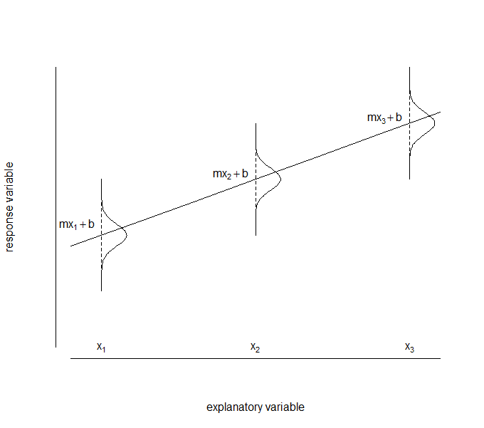

Things your parents never told you about linear regression 
================================
**Precis:** this is a tutorial to illustrate some general principles of statistical ecological modelling using linear regression. I firstly discuss some concepts behind statistical modelling before introducing maximum likelihood estimation and comparing this method of fitting regression models from scratch with common R functions lm() and glm(). 

**Credit where it is due:** I came to understand these concepts, and their implementation in R, largely as a result of reading "Ecological Models and Data in R" by Ben Bolker ('EMD' throughout). There's lots in here that comes more or less straight from the pages of that book, so if you learn anything, it's really courtesy Prof. Bolker. I highly recommend that you get the facts straight from the source and come to your own understanding. The [pdf](https://ms.mcmaster.ca/~bolker/emdbook/book.pdf) is freely available.

Other good sources of info: Marc Kery's [book](http://bayanbox.ir/view/5958854163974907854/Introduction-to-WinBUGS-for-Ecologists-Bayesian-approach-to-regression-ANOVA-mixed-models-and-related-analyses.pdf) (not sure about this link) on Winbugs - chapter 6 goes over a lot of this far more elegantly and inclusively. It covers some other stuff that I dont, notably design matrices (in a really accessible writing style). 

[Zuur et al (2009)](http://www.highstat.com/book2.htm) is a good general reference on modelling in R. 

[Venables and Ripley (2002)](http://www.planta.cn/forum/files_planta/modern_applied_statistics_with_s_192.pdf) - I only recently found this one. It's a little old and is based on S plus (a commercial version of R) but it is a classic reference. (Check out their short worked example on choosing between random intercept and slope models if you're into that sort of thing - it starts on p. 272). 

**Acknowledgements:** Firstly to recognise that Katherine and Alice are doing a most stellar job organising StatSols - great work guys. Mostly though, I am very grateful to my labmates Emilie, Maria and Michael who patiently sat through a presentation of an early version of this material and provided some insightful suggestions that allowed me to greatly improve the content.

**Disclaimer:** I am not a statistician or an educator and this work _has not been peer-reviewed_ by anyone who answers that description. I'm a community ecologist and self-taught/still-learning ecological modeller sharing my own take on these principles in the StatSols forum in the hope it proves useful. If anything is wrong then it represents my misinterpretation of the principles involved. Please do let me know if you identify anything like that. Similarly, if you would like the R markdown file I'm happy to provide it: david.deane@adelaide.edu.au 

***
## Mathematical equations vs. statistical models
Equations are about describing relationships between things, how one thing changes with another. I am going to talk only about simple equations that relate x and y in a straightforward way. The sort of equation that when you solve it for a value of x, it give's an exact answer for the value of y. 

Take the equation of a straight line: **y = mx+b**

Here:   
  y is our dependent variable- the thing we want to describe/predict/understand   
  x is our independent variable. We measure this with high certainty and use it to predict y  
  m is the slope value - the proportional change in y for a change in x     
  b is the y-intercept. That is, the value that y takes when x is zero. 
  
Using this equation, for any value we give x, we can calculate the _exact_ value of y once we specify values for m and b (our equation parameters). Each value of x only 'maps' to one y value - there is no uncertainty in the result. 

When we use the equation of the straight line in a statistical model, we are saying something fundamentally different. In our statistical model we are saying that _we dont know the exact value of y for a given value of x_. But we do know it will be within a small range of possible values, and this range of values y can take changes predictably with the value of x (as described by our equation). 

In fact, we do a lot better than this: in specifying a statistical model we are saying we not only know how the range of likely values changes, but also what the value of y will _probably_ be: its mean or expecation. We are also saying how likely it is that y will take _any_ value, providing of course that our model is correct. We specify both our expected value, and how likely other values might be, by describing the response of y as a _probability distribution_, not an exact value. Our response is probabilistic, not deterministic.

So we are saying that y will be (i) somewhere _near_ the exact value predicted by our x equation AND (ii) within this range of 'near' values, some are more likely than others.

We can think of (i) as the deterministic part (the signal) and (ii) as the error or uncertainty (the noise around the signal). 

Because we have made these assumptions explicit by specifying a probability distribution, we can test our model against what we would expect the data to look like if our model is correct. In other words, how _likely_ our model is, given the data. 

## Linear Regression
We can illustrate these concepts using linear regression. To turn our equation for a straight line into a linear regression statistical model we need to add our uncertainty about our estimate of y, for which we use a normal distribution:  

y~i~ = (m.x~i~ + b) + $\epsilon$~i~, where $\epsilon$ ~ N(0, $\sigma$)    

The value $\epsilon$~i~ is just the difference between our prediction of y~i~ using (mx~i~ + b) and the actual value of data that we observed for point y~i~. The uncertainty is described in the ~ N(0, $\sigma$) bit, which is shorthand ('math speak') for '...is normally distributed with a mean of 0 and a standard deviation of $\sigma$'.  

That is, the difference between what we predict and what we observe we describe _probabilistically_, using a normal distribution with parameters mean = 0 and standard deviation = $\sigma$'(the usual symbol for the standard deviation is Greek letter sigma: $\sigma$). Here, we believe our prediction of y will _probably_ be exactly (mx + b) - the mean (or expectation) of $\epsilon$ is zero. 

Implicit in our assumptions:  
- We believe all of our predictions (and therefore errors) have this same probability distribution  
- About two-thirds of our errors will be ± 1 sd of 0   
- Both postive and negative errors are equally likely (and make sense in this application)  

We can represent this situation of identically distributed errors graphically: 


Notice how the normal distributions are all of the same size and shape (remember our data should be i.i.d -  independent and _identically distributed_). These are critical model assumptions about the distribution of uncertainty in our process under study.


####Errors?
While we tend to call them errors, really that makes them out to be the bad guy and it's probably better to think of it as uncertainty. If it were associated with instrument precision (say, a temperature probe) it might, for example, be measurement uncertainty. 

Usually, in an ecological model, it is more likely _process_ uncertainty in our probabilistic phenomenon of interest and/or a natural result of the sampling strategy we used to measure it. For us, this is as much a part of our statistical (and biological) understanding of the system as the equation. In fact, without a realistic means (a probability distribution) to represent this process uncertainty we cant model it in a statistical model.

#### Quick refresher - what is 'linear' anyway
When one thing (y - our response variable) responds **linearly** to another thing (x - our explanatory variable) then the change in y is the same for a given change in x, _no matter what the value of the x thing is_. 

So if x goes from one to two, or from one million and one to one million and two, y will change by the same amount. We can model this sort of relationship using linear regression, also known as _simple linear regression_ or _ordinary least squares regression_. The rate at which y changes with x is the slope,m, which is one of the parameters we estimate in the model. 

If we have more than one x variable we have _multiple linear regression_. Here, what we are saying is that the effect of the x's on y are both linear _and_ **additive**. This means we believe that each x variable has it's own linear effect on y. _Additive_ means it doesnt matter what value x~2~ is at, x~1~ will change y by the same amount. So if the value of x~2~ changes the effect of x~1~ on y, then we have an _interaction_. 

As ecologists we have to think about how likely it is that things are either linear or additive if we are fitting this type of model. That's pretty much all I want to say about this sort of stuff...


#### Simulating a linear response
Below I simulate some data to which we can fit a linear regression. 

The code creates a response vector (respVec) as a linear function of an explanatory vector (expVec) adding some noise. You can imagine the x value to be, say, time in days, and the y axis to be a measure of weight of individuals (say, fish, or better yet, octopuses) in grams. 

```{r, warning = FALSE}
set.seed(108) # so everytime I run it the same random numbers are generated
expVec <- seq(21, 120) # 100 sequential integer values between 21 and 120
respVec <- (5*expVec + 10) +  rnorm(100, 0, 50) # simulate a response variable adding random noise
 
```

Taking a look at the simulated data:

```{r, warning = FALSE}
library(ggplot2,quietly=TRUE)
qplot(x=expVec,y= respVec,xlab="Time (days)",ylab="Octopus weight (g)")

```

The simulation is based on the equation for a straight line y = mx+b but I add some random noise using rnorm() and a $\sigma$ of 50 (see below)


## Fitting with lm() 
If we want to fit a linear model to these data, we have a number of unknowns to estimate. 

Two model parameters in the equation (the thing we think we can predict):   
- m (slope) and,   
- b (the y-intercept).  

We also want the precision in these estimates: the standard error in the model parameters.

Plus we have our uncertainty:  
- $\sigma$ - the standard deviation of our normally distributed uncertainty - here combining the random differences in growth rates of individuals and measurement error from an electronic balance with a justifiably indignant octopus perched atop.

In R, the usual way we would deal with such a nice linear response would be to simply call function lm(): 

```{r, warning = FALSE}
lm1 <- lm(respVec~ expVec)
summary(lm1)
```

R does all the work for us, fitting the model and telling us what we need to know to check the assumptions. From the summary() function, we can see our estimates for the slope (~ 4.9) and intercept (~15.0) and also how precisely we estimated them (the standard errors). If the parameter estimates are more than two standard errors distant from zero we usually conclude there is something going on between x and y.

What about the standard deviation? Well, in the summary it is called 'residual standard error'.

We also get a five point summary of the distribution of the residuals (our $\epsilon$ values). The median value is close to zero (in a normal distribution the mean and median have the same value, so we expect median = zero) and the 1st and 3rd quartiles are similar in the magnitude of their difference from the mean value. Same with the min and max values. So far it looks OK assumptions wise, but we really need to do some basic graphical diagnostics.  

For lm() objects the plot() function displays some graphical diagnostics for us. 

```{r echo=FALSE}
oldPars <- par(mfrow=c(2,2))
plot(lm1)
par(oldPars)
```

We are looking for a few things here - no patterns in the residuals, a nice horizontal line in the smoother around the value of zero, no influential values (high Cook's distance - R shows the row numbers of these for us).

I find it interesting, if not comforting, that even though we are fitting a model that should be 'correct' (because it is simulated based on the assumptions of the model), there can still be some patterns in the residuals.   


### Quick aside for some R syntax
For non-R folk, in the R language we use the rnorm() function to draw random numbers from a normal distribution. We need only tell R how many draws we want and at which mean and standard deviation. 

So it looks like this:
```{r, warning = FALSE}
NormVar <- rnorm(n = 100000, mean = 0, sd = 1) # give me 100000 random values from a normal distribution with a mean 0 and sd of 1.
hist(NormVar,freq=FALSE, main="Do I look normal to you?") # plot a histogram of the data
lines(density(NormVar)) # overlay a density curve to the data
```

***

## Turning things on their head:
###  Fitting a linear regression with dnorm()
Now we get to the key point for this tutorial: so far we've been describing our model as two separate parts that we somehow stick together (additively) to get our response - a deterministic equation, and some measure of uncertainty. 

But, look again at our conceptual diagram: 


We can conceptualise this same linear relationship as just being a normally distributed _phenomenon_. In this view, it just so happens that the _mean_, or expected value, of our phenomenon (measured by the y value) happens to change linearly as a function of a second variable (x). That is:   
**y~i~ ~ N(mx~i~ + b, $\sigma$)**  

Rather than: 

**y~i~ = (m.x~i~ + b) + $\epsilon$~i~, where $\epsilon$ ~ N(0, $\sigma$)**

Although for the linear model these are equivalent expressions, hopefully the conceptual difference is apparent. Rather than thinking of it as adding a probabilistic uncertainty to a determinstic equation, our entire description of the system is made purely in terms of the uncertainty - here the parameters of a normal distribution. (This was a critical point to understand for me - it helps what follows to make some sense. It turns out that we can describe all statistical models this way). 

But using lm(), R did all the work for us. If we are to build a model based on the normal distribution itself, we need some way to estimate the unknowns. What we need to know is: 'what are the values for m, b and $\sigma$ that make this overall statistical model _most likely to be true_, given our observed data x and y'? 

Enter: *maximum likelihood estimation* (MLE)

**Maximum likelihood estimation** is a framework for statistical inference (like frequentist or Bayesian inference). Likelihood is just the probability of observing a given outcome. For a set of independent observations (remember i.i.d?), the likelihood of a given model across an entire dataset is the product of the individual likelihoods for each data point. MLE is used to identify the parameter values that make our statistical model most likely. We just need to work out a way to consider all of the likelihood values for our dataset under our proposed model.

For mathematical convenience, the convention is to _minimise_ the negative log-likelihood (NLL). This means we work with sums instead of products and minimise rather than maximise, but the resulting maximum likelihood parameter estimates are the same.

To do the calculations, we use _numerical_, rather than _analytical_ methods for solving our equations. The difference is that in analytical solutions you can just calculate the answer; numerical methods are used when this is just too hard to do - you instead use trial and error, plugging in numbers until you find the set that give you the best answer.  This requires two things - something to tell us how close we are to the best answer (a likelihood function) and something to try all those different values for us and tell us the best values it found for our unknowns (optimiser): 

1. the __likelihood function__ is the judge. It turns our probability distribution based model into something R can understand and calculate how likely our answer is for a given set of parameter values.

2. the __optimiser__ is the engine room. This is a function that tries every different value that it can think of for the unknown parameters we provide and adjusts this based on the value of the likelihood function. It returns the values that result in the lowest overall log-likelihood - our _maximum likelihood estimates_ for them. Note that we need to give our optimiser function starting values (if you've ever used R function nls(), that is why you need starting values). 


### MLE for our linear regression in R
So in this section we'll put this into practice, re-fitting the linear regression we fitted above using lm(), but using the methods of maximum likelihood. We'll then compare the values. So how do we deal with the two things we need to do this?

#### 1. the likelihood function - dnorm()
The dnorm() function has similar syntax to the rnorm() funtion. But rather than generating random data for us based on a set of parameter values, we instead _give it both our data and parameter values_ and it spits out the 'probability density'. Probability density is the *likelihood* that the data were generated by our probability distribution, given the parameters we specify. This is exactly what we want to know - so if we run the dnorm() density function on the log of all our data points for each parameter estimate and then add up all those probability densities, the result is the overall negative log likelihood (NLL) of our model, given the data and those parameters. 

#### 2. the optimiser - optim()
There are two R functions that I am familiar with for optimisation, but there are zillions of others I've no doubt. The stats package has optim() and package bbmle has mle2() - a 'wrapper' function for optim() that makes life easier. I use both below, starting with mle2().

The following chunk (code block) creates a NLL function specifying the model and parameters. The function is called 'norm.NLL()' and we pass it three arguments: m,b and $\sigma$. It takes those values and calculates the NLL value for the statistical model. mle2() then iteratively tests values for the parameters until it reaches some predetermined conditions that are considered to indicate it has found the MLE. This is known as 'converging on a solution'. 

```{r, warning = FALSE}
library(bbmle,quietly=TRUE) # need to load this package for mle2()

# the negative log likelihood function
norm.NLL <- function(m,b,sd){ # create a function called "norm.NLL" that will be passed 3 things: m,b and sd
   -sum(dnorm(respVec, mean= m*expVec + b , sd=sd, log=TRUE)) # negative log likelihood equation 
}

# the optimiser using mle2
mle2_Out <- mle2(norm.NLL, start= list(m=10, b=10, sd=20)) # bbmle::mle2 this is a wrapper for optim()

# how'd we go? 
mle2_Out
```

Comparing with lm() what do we see?  

value    | lm()     | MLE   |
------   |-------   |-------|   
slope    |  4.88    |  4.87  |  
intercept     | 15.63    | 15.89 |    
$\sigma$       | 45.80    | 45.34 | 

So pretty close, not perfect.

_(Hint for re-using this: notice in the R chunk I have encoded the x and y data directly into the function - you need to think about things like this when you transfer your code between applications)_.

Function optim() is a bit trickier - it only accepts 2 arguments, but we have three parameters to estimate. We get around this by passing it an object containing the parameters. I like to use a named list to keep track of them - BUT dnorm wont find them by name unless you declare them within the function call (here called 'Optnorm.NLL'). 

```{r, warning = FALSE}
Optnorm.NLL <- function(pars){ # create a function that will be passed 3 things: m,b and sd
  b=  pars[1] # variable names need to be assigned
  m=  pars[2]
  sd= pars[3]
 -sum(dnorm(respVec, mean= m*expVec + b, sd= sd, log=TRUE)) # negative log likelihood equation 
  }

pars <- list(b = 10, m= 10,sd = 20) # parameter starting values 

lmFit <- optim( fn = Optnorm.NLL, pars, method="Nelder-Mead") 
# the optimiser - we give it the NLL fn and starting values. 
# there are a number of different numerical optimisers, here we use the default 'BFGS' see ?optim

lmFit$par # how'd we go on the parameter estimates
lmFit$value # and log-likelihood
```

Note the MLE are different from mle2, because even though they both use optim(), we specified a different algorithm - which seems to have done a little better. lm() uses an analytical method to estimate parameters called ordinary least squares so it is preferred. In other applications - that is, statistical models that dont assume normal errors - the errors arent additive and this method cannot be used. 


#### What about the standard errors in the parameters? 
One thing we get from lm() that we dont get with MLE is an estimate of the uncertainty in the parameter estimates. OK, we have our maximum likelihood estimates, but we need to know how precisely we have predicted these values. For this we use a likelihood profile. The basic idea is to see how a small range of values around the MLE for parameter changes the NLL. We need to re-calculate the MLE for any other parameters to get the correct value. A $\chi$^2^ statistic can be used to calculate how far you need to go before the value is unlikely to be realistic. A 95% confidence limit change in NLL value is 1.92.

If you're super funky you might fit a likelihood surface to see how the two parameter NLL change as we move away from the MLE.   

```{r, warning = FALSE}

profm <- c() # create an object to hold the NLL profile for parameter b
mvec <- seq(4,5.5,by=0.01) # create a vector of values to calculate NLL 


# now run a for loop to pass the values of the vector and calculate how NLL changes
for(i in 1:length(mvec)){
  # assign the current m value an object
  mval = mvec[i]
  
  # starting values for each iteration  
  par1 <- list(b = 10, sd = 20) # parameter starting values 
  
  # modified NLL function  
  norm.NLLp <- function(par1,m = mval){ # calculate the NLL for the current m value
   -sum(dnorm(respVec, mean= m*expVec + par1[1] , sd= par1[2], log=TRUE))} # negative log likelihood equation 
  
  
  # optimise the other pars for the m value under test
  lmFitp <- optim( fn = norm.NLLp, par1, method="Nelder-Mead")
  
  #  save the value of the optimised NLL for the current m value in object profm
profm[i] <- -sum(dnorm(respVec, mean = mval*expVec + lmFitp$par[1], sd = lmFitp$par[2],log=TRUE))   
}

lrt.nll <- min(profm)+1.92 # set cutoff for confidence limits

# plot the profile
qp1 <- qplot(x = mvec,y = profm, geom = "line",xlab="value of m",ylab="NLL")
qp1 + geom_hline(aes(yintercept = lrt.nll),linetype=2)
```

So how do the values for the confidence intervals compare?
```{r, warning = FALSE}
cilo <- mvec[min(which(profm<lmFit$value+1.92))]
cihi <- mvec[max(which(profm<lmFit$value+1.92))]

c(cilo,cihi)
```
This gives us an estimate of 4.88 [4.57, 5.19] for our slope using MLE compared with 4.88 [4.56, 5.19] for lm() allowing 2 x standard errors. 

Moving on, you might be wondering what sorts of models can be fit using MLE? Lots. Basically we can combine any deterministic and stochastic models that we can come up with a likelihood function. I'll now go over a couple of these. 


## Roll your own GLM with Poisson errors (EMD p 408)
So far we've used the normal distribution, which is great for continuous variables particularly things like population heights or weights which tend to be, well, normally distributed. And continuous - it makes sense to have a height of 1.345 m. 

But many, many things are either a) not continuous (e.g. presence absence data), or b) just not normally distributed (e.g. count data). If we are to use statistical models for these phenomena, then it's time to meet some more probability distributions.

Generalised linear models (glm) are a class of models that are an extension of linear regression allowing for non-normal error structures (or non-continuous data types). For binary (e.g. presence-absence data) we have the binomial distribution. For count data (which must by definition be positive and take integer values (1,2,3... - we cant have 1.4 individuals) we have the Poisson and negative binomial distributions. 

The Poisson is one of the most useful probability distributions. This distribution describes count data occurring within a given area or time, providing the events you are counting are independent. It is commonly used for modelling numbers of individuals. For example, say you went fishing over Christmas, you might model the number of fish you caught each day as a function of the number of beers you drank (or say, the maximum air temperature), assuming of course that each day's catch was independent (you hadnt caught so many in a day that you depleted the population affecting your chances the next day for example).  

Unlike the normal distribution, which has two parameters (mean and standard deviation), the Poisson has only one - $\lambda$ the mean expected value. An interesting (and useful) characteristic of the Poisson is it's mean is equal to it's variance. As the mean value goes up, so does the variance this is a common observation in ecological data (note that variance structures differ between distributions as do means). 

It is a discrete distribution, meaning you can only model integer values - but the $\lambda$ parameter of the distribution is continuous. 

In a generalised linear regression there is one other thing to be aware of. The link function. We still use our old friend the equation of a straight line, but in a glm the linear part is modified via a link function. You might be familiar with Poisson distributed error structures as one of the families in generalised linear regression - in a Poisson glm the link function is simply the log of y. 

In R this is glm(y~x, family="poisson"). R fits a linear model via a log-link function meaning log(y) = mx + b   


```{r, warning = FALSE}
set.seed(108) # so the random draws are the same each time

# generate some Poissonish data. rpois() is like rnorm()
respP <- rpois(length(expVec), lambda = (0.5*expVec ))

# first we need to round out to integers
respP <- round(respP)

# we can fit the data with a glm for comparison with MLE
glm1 = glm(respP ~ expVec, family = "poisson")

# output the results
summary(glm1) 
logLik(glm1)

```
Firstly check out the values of the Residual deviance (103) and the residual degrees of freedom (98). These should have a ratio of about 1 - here we see it is ok, but that's because we simulated the data using rpois(). If the ratio clearly exceeds 1, then your data are considered to be over-dispersed -- the distribution of the data do not fit a Poisson -- and you need to try something like a negative binomial error structure or zero-inflated Poisson (see Zuur et al 2009; ht MGS). Be aware if you want to fit a Poisson glm to your count data that most ecological datasets have too many zeros to meet the distribution. A Poisson glm often wont work... 

But we do this using MLE the same way -- we specify the model in terms of the uncertainty in the process: the Poisson distribution.

```{r, warning = FALSE}

# Repeat using the NLL approach. 

# First the NLL function (note the exp() function to account for the link function)

NLLpois = function(pRegPar) {
   Ypr = exp(pRegPar[1] + pRegPar[2] * expVec) # Note here I specify the deterministic part separately - Ypr
   -sum(dpois(respP, lambda = Ypr, log = TRUE)) # and pass Ypr to the NLL function. You can do it like this too... 
   }

# set starting values for the parameters in the linear predictor
pRegPar <- c(a = 5, b= 0.5)

# run the optimiser 
pReg <- optim( fn = NLLpois, par=pRegPar, method="BFGS")

# view the output
pReg$par

# LL value
pReg$value

# AIC value = -2.NLL + 2.parameters
-2*-pReg$value + 2*2
```

Comparing MLE with glm():  

value    | glm()     | MLE |    
------   |-------   |-------|
slope    |  0.01562  |  0.01560  |  
intercept     | 2.365    | 2.366 |    
AIC | 635.08 | 635.08 | 

The optimiser result has _slightly_ higher AIC. Lower is better, so this suggests the MLE is not quite as successful at fitting than the default glm() method.

So where are we? Given you can do everything so far (a little better) using canned routines like lm() and glm() you might be thinking 'so what'. The power really is in the flexibility you have to define the model according to your biological mechanisms. One more example to give the flavour.   

***

## Customising 
We basically have all the tools now to roll our own statistical models with MLE now. We can combine whatever mechanistic function we want (EMD gives a nice list, starting p.109), with whatever uncertainty model (probability distribution; EMD again Ch.4, starting p.160) describes our process of interest/sampling situation. 'All we need' is a log-likelihood function for our probability distribution and a way to parameterise it so the expected value for our deterministic part is encoded. This can be pretty tough on the (at least my) brain, but this is an example of where the R-user community is absolutely amazing. 

Each model we pose should be viewed as a hypothesis and we typically pose multiple working hypotheses and test relative support for each using our maximum likelihood estimates and some form of information criterion (such as Akaike's information criterion - AIC) to choose between models, according to the data. 

Say for example we are interested in wetland productivity and have a theory that resource limitation will result in a negative density dependence in a wetland sedge species. We count both the number of adults and the number of new tillers (shoots) in 200 0.5m x 0.5m quadrats over some period of time, predicting it will be a non-linear decreasing function of the existing density of adult culms due to decreasing resource availability. Perhaps some studies in other vegetation types have found a negative exponential relationship, others a hyperbolic function. We decide to fit both of these using the Poisson distribution to describe the uncertainty because it is count data. We are also concerned about over-dispersion and so will also fit a negative binomial model. 

Let's simulate the data:
```{r, warning = FALSE}
nMat <- seq(from = 0, to = 200, by = 1) # number of mature culms are our predictor
nMat <- jitter(nMat) # add a small amount of random noise to the x values

set.seed(108)
tillDens <- rpois(length(nMat), lambda = 250/(25+nMat)) 
# tiller density as a random Poisson variable, with a mean value described by a hyperbolic function y = a/(b+x)

tillDens <- round(tillDens) #  round to integer (to simulate count data)
```

We can inspect the simulated data, using ggplot2 to fit a locally weighted smoother to show any trend
```{r, message = FALSE}
library(ggplot2, quietly=TRUE) 
gpl01 <- ggplot()+
  geom_point(aes(x=nMat,y=tillDens))+
  ylab(bquote('Number of new shoots ('*m^-2*')'))+
  xlab(bquote('Density of adult culms ('*m^-2*')'))+
  stat_smooth(aes(x=nMat,y=tillDens),level=0.99)

gpl01
```

First we fit the hyperbolic function:

**y = a/(b + x)**  

```{r, warning = FALSE}
# now we need our log-likelihood function 
NLLhypPois = function(poisPar) { 
  Ypr = (poisPar[1] / (poisPar[2] + nMat))
  -sum(dpois(tillDens, lambda = Ypr, log = TRUE))
}

# our parameter estimate starting values
poisPar <- list(a=20, b=1)

# and our optimiser 
optHP <- optim(fn = NLLhypPois, par=poisPar, method="BFGS")

# how'd we go remembering a=250 and b = 25
optHP$par

# and AIC
-2*-optHP$value + 2*2

```

Now we test support for the negative exponential function:

**y = a.e^-bx^**

```{r, warning=FALSE}
# now we need our log-likelihood function to encode the negative exponential function 
NLLnexPois = function(poisPar) { 
  Ypr = poisPar[1]*exp(-nMat*poisPar[2])
  -sum(dpois(tillDens, lambda = Ypr, log = TRUE))
}

# our parameter starting values
poisPar2 <- list(a=30, b=0.004)

# and our optimiser 
optNE <- optim(fn = NLLnexPois, par=poisPar2, method="BFGS")

# parameter values arent of interest for us because it is a different deterministic model
# but support for the model is important
-2*-optNE$value + 2*2

```

Finally we try a different stochastic component - here we re-fit the hyperbolic model with negative binomial instead of Poisson probability.
```{r, warning=FALSE}
nbinhNLL <- function(nbinPar){
  a = nbinPar[1]
  b = nbinPar[2]
  size = nbinPar[3]
  predTill = a/(b + nMat) # specify the model form
  -sum(dnbinom(tillDens, mu= predTill, size = size, log =TRUE)) 
}

nbinPar <- list(a= 500,b=10,size = 0.1)

onbh <- optim(fn = nbinhNLL, par=nbinPar, method="BFGS")

# we can compare the estimates for a and b with the Poisson hyperbolic model with the 'true' values
onbh$par

# and compare model support using AIC
-2*-onbh$value + 2*2

```

Finally, it's interesting to fit this model using the R function nls(), standing for 'non-linear least squares' which fits whatever equation you give it with normal error structure.
```{r}
nls1 <- nls(tillDens~a/(b+nMat), start=list(a=200,b=20))
summary(nls1)
AIC(nls1)
```
Interesting that the parameter estimates are quite close, but the AIC indicates it isn't in the ballpark with our other models. This is because the probability model is all wrong. 

Testing support for our three models (hypotheses) and nls() fit:  

value          | ~ Pois($\lambda$ = hyperbolic) | ~ Pois($\lambda$ = neg. exp.)   | ~negBin($\lambda$ = hyperbolic)| nls()   |   
-----------    |-----------                     |-------                          |--------                        |-------- |   
AIC            | 685.591  | 699.279 | 687.211 | 724.314 |  
$\Delta$AIC    | 0.0       | 13.7    | 1.62    | 38.7     |  
 *w*AIC        | 0.69  | 7.4e-04  | 0.31  | 2.7e-09|   
Evidence ratio | 1.0 | 938 | 2.5 | 2.6^8^ |  

We conclude the hyperbolic with Poisson uncertainty is our top ranked model, but being within 2 AIC you wouldnt rule out the negative binomial model. What we can say for sure is the deterministic part is much better described by the hyperbolic function than the negative exponential function - a difference of >10 in AIC is considered to suggest effectively no support for the model with the larger value. We can see this in the Akaike weight (*w*AIC) and evidence ratios. 

If you proposed the hyperbolic and negative exponential models as alternative explanations on mechanistic, biological grounds (that is the parameters had some meaningful interpretation), you'd have a good argument in favour of your model based on the hyperbolic function here. 